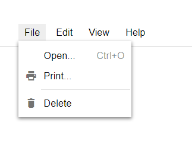

An extremely lightweight JavaScript library for dropdown menus by Morgan McGuire. Just insert the `menu.js` file into your program and then build the menu out of `div` and `a` elements as shown in `demo.html`. Only 3kb of BSD-licensed open source code. The default styling is based 
on Google Docs.

