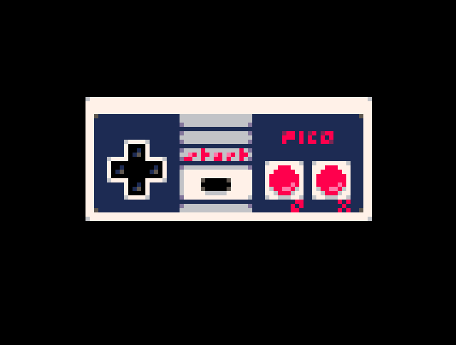

Procedural PICO-8 controller image generator. For use in generating instruction screens with no
sprite memory cost. Consumes 366 tokens and 823 characters when the first line of centering
code and the comments are removed.

by [@CasualEffects](https://twitter.com/casualeffects)

