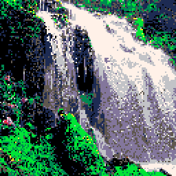

Fast PICO-8 particle system by Morgan McGuire http://casual-effects.com @CasualEffects. Free
for reuse in any context, but please retain my name in the code.

- Direct memory rendering
- Performance optimized for clamping via bitwise operations
- Gravity
- Maximum particle lifetimes
- O(1) insertion and removal

Ignores palette settings and camera offset for speed. Adjust your particle positions directly.

PICO-8 assigns a virtual cycle count to each operation. My code is optimized to minimize PICO-8
cycles in the emulator, regardless of what the load is on the actual machine executing the
code.

There are two clever tricks going on here. The first is that:

~~~~~~~~~~~~~~~~~~~~~~~~~~~~~~~~~~~~~~~~~~~~~~~~~~~~~~~~~~~~~~~~~~~~~~~~~
band(bor(particle.x, particle.y), 0xff80) != 0
~~~~~~~~~~~~~~~~~~~~~~~~~~~~~~~~~~~~~~~~~~~~~~~~~~~~~~~~~~~~~~~~~~~~~~~~~

is equivalent to the much slower:

~~~~~~~~~~~~~~~~~~~~~~~~~~~~~~~~~~~~~~~~~~~~~~~~~~~~~~~~~~~~~~~~~~~~~~~~~
particle.x < 0 or particle.y < 0 or particle.x > 127 or particle.y > 127
~~~~~~~~~~~~~~~~~~~~~~~~~~~~~~~~~~~~~~~~~~~~~~~~~~~~~~~~~~~~~~~~~~~~~~~~~

Because if the sign bit or any bit higher than the 0x7f needed for expressing 127 is set in
either number, then the coordinates are out of bounds.

The second trick is that I'm directly writing to PICO-8 video memory. Since the pixels are
4-bit ("one nibble"), I have to do some masking to ensure that the code writes to the correct
nibble. I haven't found a way to avoid that branch without incuring more operations.
