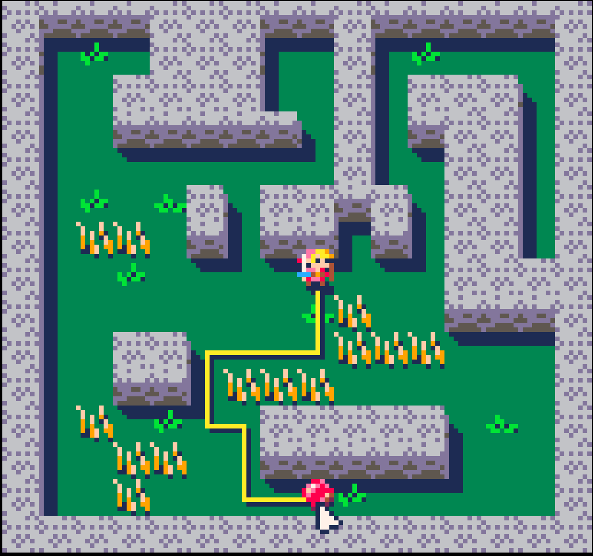

"pathfinder" is a single-function, optimized path finding library for PICO-8 Lua from the
[Graphics Codex](http://graphicscodex.com).

The `find_path` function finds a heuristically shortest path from `start` to `goal` using the
[A*](TODO) ("A-star") algorithm, and returns it as a list of nodes to visit. Returns `nil` if
there is no path. You can also guarantee that the true shortest path is returned (at a cost of
running longer) by providing a zero-value estimator function, which reduces `find_path` to
[Dijkstra's Algorithm](TODO).

The caller determines the structure of the `node` objects and how they are connected to form
the `graph`. So, `find_path` can work with any kind of graph representation and is not limited
to using the PICO-8 map functions from the demo. You can use it with 3D maps, hex maps, etc.

`find_path` parameters:

`start : node`
: The starting position in your chosen node representation.

`goal : node`
: The goal position in your chosen node representation.

`estimate : function(node, node, graph)`
: Guesses what the total path cost is to travel from
: the first node to the second in the graph. If this function
: returns `0` for all paths, then `find_path` reduces to Dijkstra's 
: Algorithm and guarantees that it finds the shortest path.

`edge_cost : function(node, node, graph)` 
: The exact cost to move from the first node to the second, which is known to 
: be its neighbor in the graph.  It does not have to be a symmetric cost, so
: you can have hills, one-way doors, etc.

`neighbors : function(node, graph)`
: Returns an array of all neighbors nodes that are reachable in one step
: from the argument node.

`node_to_id : function(node, graph)`
: Returns a unique integer or string for the node.  ids must be 
: unique and deterministic. `node_to_id(a, g) == node_to_id(b, g)` 
: must be true if and only if `a` and `b` describe the same
: location.

`graph : graph`
: The graph object, of your own design. If the data needed for 
: implementing the callback functions are all global, then this
: may be `nil`.

See the Graphics Codex for a description of the algorithm
