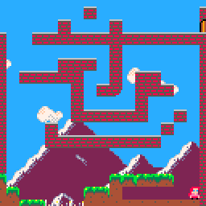

Morgan McGuire, 2017. Open Source under the BSD or MIT license--your choice!

This is code demonstrating how to simulate player-character movement in a 2D platformer
with the following features:

* variable ground friction (e.g., ice)
* gravity
* terminal velocity
* jumping
* variable-height jumping
* hazards (e.g., spikes)
* wall-sliding (w/ variable friction)
* wall-jumping
* early jump grace period (http://kpulv.com/106/Jump_Input_Buffering/)
* late jump grace period (http://kpulv.com/123/Platforming_Ledge_Forgiveness/)

This is programmed in the style of PICO-8 lua with the assumption of 8x8 pixel sprites (which
is why it has only lower-case letters and is designed to minimize tokens).  See:

* `platformer.lua` for the fully-commented version and
* `platformer-min.lua` for a more minimalist version.

This assumes the following functions:

* `hsolid(x, y1, y2)` returns true if pixel (x, y1) or (x, y2) is solid with respect to
   horizontal movement
* `vsolid(x1, y, x2)` returns true if pixel (x1, y) or (x2, y) is solid with respect to
   vertical movement
* `friction(x, y)` returns the friction multiplier (tuned for 0-8) for the block at pixel (x, y)
